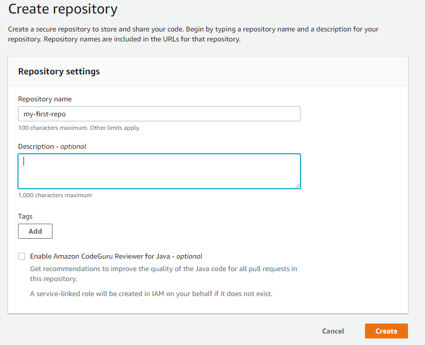
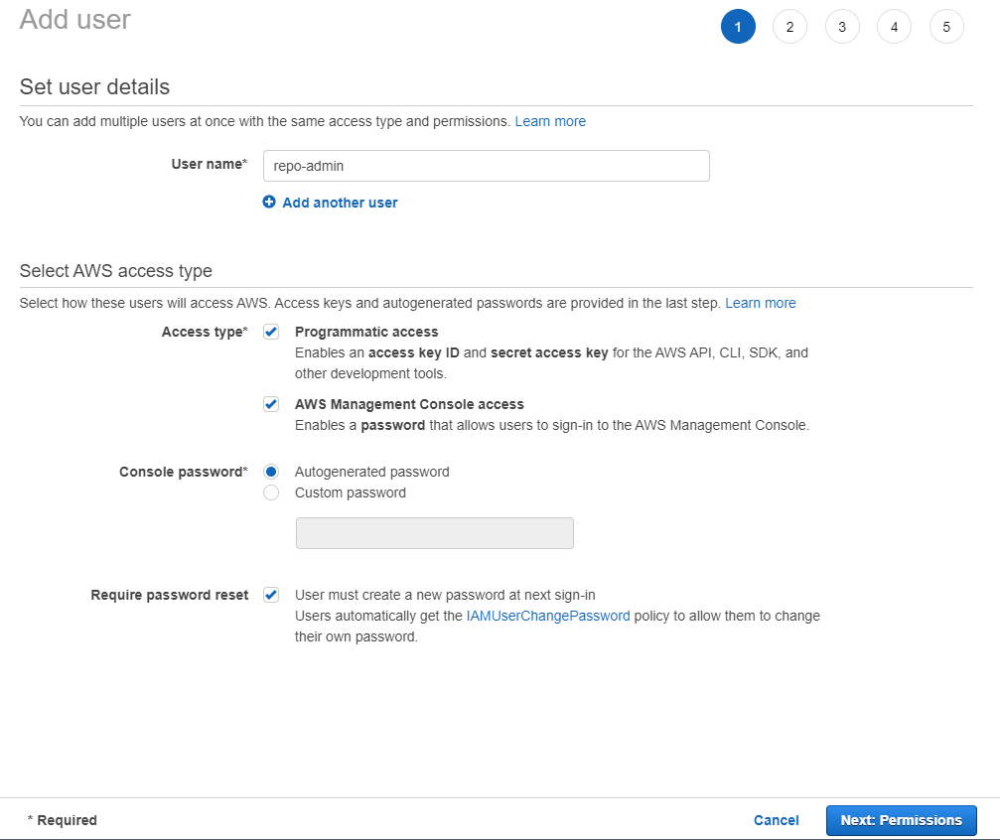
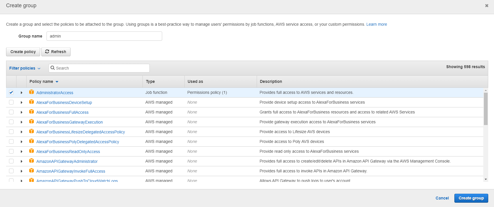
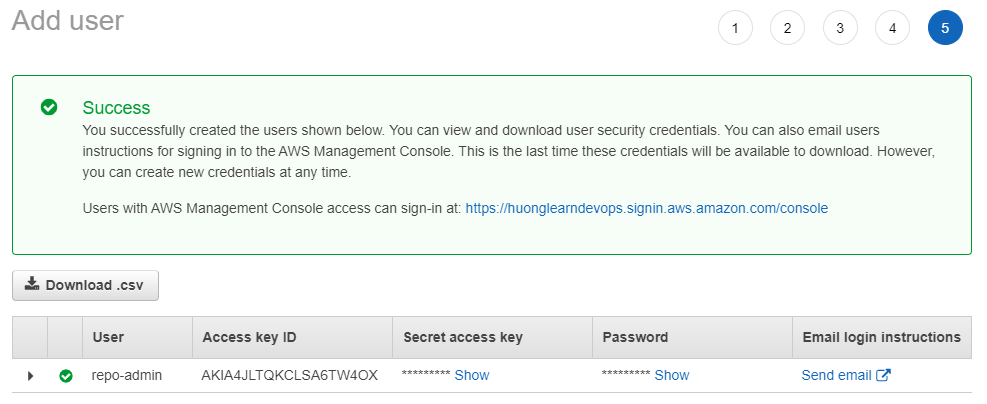

# Hướng dẫn sử dụng service CodeCommit

1. Mục lục
    * Giới thiệu về CodeCommit
    * Hướng dẫn tạo CodeComit repo trên AWS Console
    * Các lệnh Git căn bản
    * 

2. Giới thiệu về CodeCommit
    CodeCommit là một ứng dụng quản lí source code dưa trên Git và được quản lí bởi AWS. CodeCommit là ứng dụng tương tự như GitHub hoặc Bitbucket. Một số tính chất của CodeCommit có thể kể đến như là: 
    * Được quản lí bởi AWS
    * Bảo mật
    * Là 1 private git repository
    * Chỉ sử dung được với AWS Cloud
    * có thể tích hợp với các ứng dụng kahc1 như Jenkins, CodeBuild, etc.
    
3. Hướng dẫn tạo CodeCommit repo trên AWS Console
    * **Step1**: Đăng nhập tài khoản vào trang console của Amazon Web Service > xổ tab **Services** > Chọn **Codecommit**. Chúng ta sẽ được chuyển tới trang như hình dưới
    

    * **Bước 2**: Tạo repository
        * Chọn **Create repository** bên góc phải màn hình
        * Đặt tên cho repository (ví dụ: my-first-repo), sau đó bấm nut **Create**
        
    * **Bước 3**: Create IAM user để kết nối tới CodeCommit repo
        * Xổ tab **Service** > chọn **IAM**
        * Chọn thẻ **Users** > chọn **Add user** > điền thông tin như hình dưới sau đó bấm **Next: Permissions**
        
        * Tạo group với quyền addmin, sau đó add user vào group
        
        * Tiếp tục bấm **Next** cho tới bước cuối cùng > Bấm **Create user**  
        Sau khi tạo user, bạn sẽ được cung cấp 1 user credential. Download file csv
         
        
        * Chọn user mới tạo > chọn tab **Security credentials** > ở mục **HTTPS Git credential for AWS CodeCommit**, bấm **Generate credentials** > lưu username và password mới tạo. Như vậy mình đã có thể kết nối Codecommit từ local machine.

        * Để sao chep repo về local machine, vào lại dịch vụ CodeCommit, chọn repo cần sao chép, Chọn **Clone URL** > **Clone HTTPS**, bạn sẽ được cung cấp 1 đường link để sao chép repo về local
