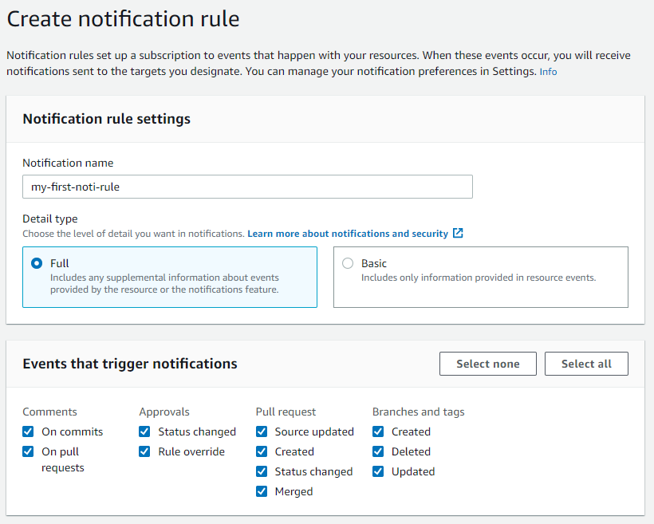

# Hướng dẫn  căn bản sử dụng dịch vụ CodeCommit

1. ### Mục lục
    * Giới thiệu về CodeCommit
    * Hướng dẫn tạo CodeComit repo trên AWS Console
    * Cài đặt thông báo cho CodeCommit
    * Lời kết

2. ### Giới thiệu về CodeCommit
    CodeCommit là một ứng dụng quản lí source code dưa trên Git và được quản lí bởi AWS. CodeCommit là ứng dụng tương tự như GitHub hoặc Bitbucket. Một số tính chất của CodeCommit có thể kể đến như là:
    * Được quản lí bởi AWS
    * Bảo mật
    * Là 1 private git repository
    * Chỉ sử dung được với AWS Cloud
    * có thể tích hợp với các ứng dụng kahc1 như Jenkins, CodeBuild, ...  
3. ### Hướng dẫn tạo CodeCommit repo trên AWS Console
    * **Step1**: Đăng nhập tài khoản vào trang console của Amazon Web Service > xổ tab **Services** > Chọn **Codecommit**. Chúng ta sẽ được chuyển tới trang như hình dưới
    

    * **Bước 2**: Tạo repository
        * Chọn **Create repository** bên góc phải màn hình
        * Đặt tên cho repository (ví dụ: my-first-repo), sau đó bấm nut **Create**
        
    * **Bước 3**: Create IAM user để kết nối tới CodeCommit repo
        * Xổ tab **Service** > chọn **IAM**
        * Chọn thẻ **Users** > chọn **Add user** > điền thông tin như hình dưới sau đó bấm **Next: Permissions**
        
        * Tạo group với quyền addmin, sau đó add user vào group
        
        * Tiếp tục bấm **Next** cho tới bước cuối cùng > Bấm **Create user**  
        Sau khi tạo user, bạn sẽ được cung cấp 1 user credential. Download file csv
         
        * Chọn user mới tạo > chọn tab **Security credentials** > ở mục **HTTPS Git credential for AWS CodeCommit**, bấm **Generate credentials** > lưu username và password mới tạo. Như vậy mình đã có thể kết nối Codecommit từ local machine.

        * Để sao chep repo về local machine, vào lại dịch vụ CodeCommit, chọn repo cần sao chép, Chọn **Clone URL** > **Clone HTTPS**, bạn sẽ được cung cấp 1 đường link để sao chép repo về local
4. ### Cài đặt thông báo cho CodeCommit
    AWS CodeCommit cung cấp cho người dùng chức năng thông báo khi có những thay đổi trên repository. Những thay đổi này có thể được thông báo qua email. Sau đây là hướng dẫn cơ bản để tạo thông báo qua email khi có thay đổi trên repository.  
    * **Bước 1**: Tạo **Notification rules**  
    Chọn **Setting** > Chọn tab **Notifications** > Click **Create notification rule**  
    Điền thông tin vào như hình dưới. Khi developer tạo thay đổi repo bất kì như commit code mới, tạo pull request, tạo hay xóa branch ..., thông báo về thay đổi sẽ được gửi qua email cho người quản lí repo.
    
    * **Bước 2**: Tạo SNS topic
    ở bước này, chúng ta tạo SNS topic như là mục tiêu để CodeCommit gửi thông báo tới  
    Sau khi tạo notification rules, keo xuống mục Target, click **Create target**, chọn target sau đó bất **Submit**  
    Vào dịch vụ **Amazon SNS**, chon SNS topic chúng ta vừa tạo, sau đó create subscription. Trong mục **Protocol** chọn **Email** và nhập email muốn gửi.

5. ### Lời kết
    CodeCommit là một phần trong CICD stack cung cấp bới AWS. Trong những bài viết tiếp theo, mình sẽ chia sẽ cách sử dụng những dịch vụ còn lại như CodePipeline, CodeBuild, CodeDeploy...
