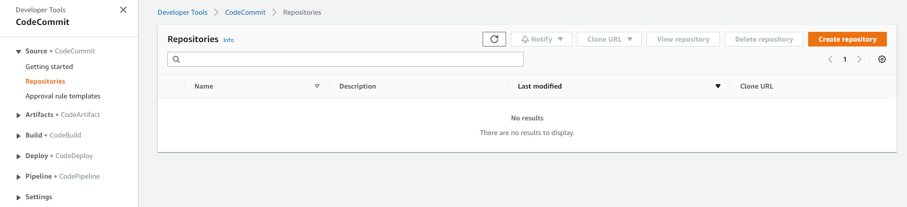

# Hướng dẫn sử dụng service CodeCommit

1. Mục lục
    * Giới thiệu về CodeCommit
    * Hướng dẫn tạo CodeComit repo trên AWS Console
    * Các lệnh Git căn bản
    * 

2. Giới thiệu về CodeCommit
    CodeCommit là một ứng dụng quản lí source code dưa trên Git và được quản lí bởi AWS. CodeCommit là ứng dụng tương tự như GitHub hoặc Bitbucket. Một số tính chất của CodeCommit có thể kể đến như là: 
    * Được quản lí bởi AWS
    * Bảo mật
    * Là 1 private git repository
    * Chỉ sử dung được với AWS Cloud
    * có thể tích hợp với các ứng dụng kahc1 như Jenkins, CodeBuild, etc.
    
3. Hướng dẫn tạo CodeCommit repo trên AWS Console
    * **Step1**: Đăng nhập tài khoản vào trang console của Amazon Web Service > xổ tab **Services** > Chọn **Codecommit**. Chúng ta sẽ được chuyển tới trang như hình dưới
    

